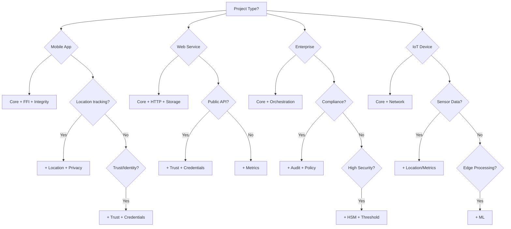
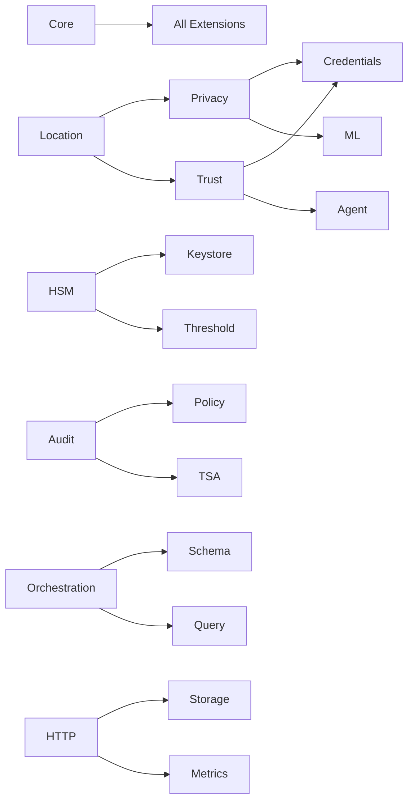

# Extension Selection Guide

Choose the right extensions for your use case with this comprehensive guide.

## Quick Decision Tree



## Extension Matrix by Use Case

### 📱 Mobile Applications

| Use Case | Required Extensions | Optional Extensions |
|----------|-------------------|-------------------|
| **Location Tracker** | Core, FFI, Location, Integrity | Privacy, Storage |
| **Contact Tracing** | Core, FFI, Location, Privacy, Trust | Credentials |
| **Digital Identity** | Core, FFI, Credentials, Trust, Keystore | HSM, Integrity |
| **Mobile Wallet** | Core, FFI, Keystore, Credentials | Threshold, HSM |

### 🌐 Web Services

| Use Case | Required Extensions | Optional Extensions |
|----------|-------------------|-------------------|
| **REST API** | Core, HTTP, Storage | Metrics, Audit |
| **Data Platform** | Core, HTTP, Storage, Query, Schema | Orchestration |
| **Analytics Service** | Core, Storage, Query, Metrics | Privacy, ML |
| **Authentication Service** | Core, HTTP, Trust, Credentials | HSM, Policy |

### 🏢 Enterprise Systems

| Use Case | Required Extensions | Optional Extensions |
|----------|-------------------|-------------------|
| **Audit System** | Core, Audit, Policy, Storage | HSM, TSA |
| **Compliance Platform** | Core, Audit, Policy, Privacy, Schema | Orchestration |
| **Key Management** | Core, HSM, Keystore, Threshold | Audit, Policy |
| **Data Governance** | Core, Schema, Policy, Privacy | Query, Audit |

### 🤖 AI/ML Systems

| Use Case | Required Extensions | Optional Extensions |
|----------|-------------------|-------------------|
| **Federated Learning** | Core, ML, Privacy, Network | Agent, Metrics |
| **AI Agent Network** | Core, Agent, Trust, Network | ML, Audit |
| **Edge Inference** | Core, ML, Storage | Metrics, Privacy |
| **Model Registry** | Core, ML, Schema, Storage | Audit, TSA |

## Extension Dependencies

Some extensions work better together:



## Performance Impact

### Lightweight (< 100KB overhead)
- ✅ Core
- ✅ Keystore
- ✅ Metrics
- ✅ Integrity

### Medium (100KB - 1MB)
- 🔶 Location
- 🔶 Trust
- 🔶 Privacy
- 🔶 Storage
- 🔶 Network

### Heavy (> 1MB)
- 🔷 ML
- 🔷 PQC
- 🔷 HSM (with drivers)
- 🔷 Orchestration

## Platform Compatibility

| Extension | iOS | Android | Web | Linux | Windows | macOS |
|-----------|-----|---------|-----|-------|---------|--------|
| **Core** | ✅ | ✅ | ✅ | ✅ | ✅ | ✅ |
| **FFI** | ✅ | ✅ | ✅ | ❌ | ❌ | ❌ |
| **Location** | ✅ | ✅ | 🔶 | ✅ | ✅ | ✅ |
| **Integrity** | ✅ | ✅ | ❌ | ❌ | ❌ | ❌ |
| **Keystore** | ✅ | ✅ | 🔶 | ✅ | 🔶 | ✅ |
| **HSM** | ❌ | ❌ | ❌ | ✅ | ✅ | ✅ |
| **HTTP** | ❌ | ❌ | ✅ | ✅ | ✅ | ✅ |
| **ML** | 🔶 | 🔶 | 🔶 | ✅ | ✅ | ✅ |

Legend: ✅ Full Support | 🔶 Partial Support | ❌ Not Supported

## Security Considerations

### High Security Requirements
**Must Have:**
- HSM or Keystore
- Audit
- Policy
- Integrity (mobile)

**Consider:**
- Threshold signatures
- PQC (future-proofing)
- TSA (timestamping)

### Privacy Requirements
**Must Have:**
- Privacy
- Credentials

**Consider:**
- Threshold (for key splitting)
- ML (for on-device processing)

## Regulatory Compliance

### GDPR/CCPA
- ✅ Privacy (required)
- ✅ Audit (required)
- ✅ Policy (required)
- 🔶 Credentials (recommended)

### HIPAA
- ✅ Audit (required)
- ✅ Policy (required)
- ✅ HSM (required for PHI)
- ✅ Privacy (required)

### PCI-DSS
- ✅ HSM (required for card data)
- ✅ Audit (required)
- ✅ Policy (required)
- 🔶 Integrity (recommended)

### SOC2
- ✅ Audit (required)
- ✅ Policy (required)
- 🔶 Metrics (recommended)
- 🔶 TSA (recommended)

## Migration Strategies

### Starting Minimal
```toml
# Phase 1: Core functionality
[dependencies]
olocus-core = "0.1"

# Phase 2: Add primary feature
olocus-location = "0.1"  # OR your main extension

# Phase 3: Add supporting features
olocus-privacy = "0.1"
olocus-storage = "0.1"
```

### Growing to Enterprise
```toml
# Phase 1: Basic enterprise
[dependencies]
olocus-core = "0.1"
olocus-audit = "0.1"
olocus-storage = "0.1"

# Phase 2: Add compliance
olocus-policy = "0.1"
olocus-privacy = "0.1"

# Phase 3: Add security
olocus-hsm = "0.1"
olocus-threshold = "0.1"

# Phase 4: Add orchestration
olocus-orchestration = "0.1"
olocus-schema = "0.1"
```

## Cost Considerations

### Free/Open Source
All core extensions are MIT/Apache licensed

### Additional Costs May Apply
- **HSM**: Hardware or cloud HSM costs
- **TSA**: Third-party timestamp service
- **Storage**: Database hosting (RocksDB, SQLite)
- **Network**: Infrastructure costs

## Testing Recommendations

### Unit Testing
```toml
[dev-dependencies]
olocus-core = { version = "0.1", features = ["test-utils"] }
# Mock implementations for testing
```

### Integration Testing
- Use `Memory` storage backend
- Use `Mock` HSM backend
- Use `Local` TSA provider

### Performance Testing
```bash
# Benchmark specific extensions
cargo bench --package olocus-location
cargo bench --package olocus-ml
```

## Common Pitfalls to Avoid

### ❌ Don't
- Start with all extensions
- Mix incompatible versions
- Ignore platform limitations
- Skip security extensions in production

### ✅ Do
- Start minimal and add as needed
- Use compatible version sets
- Test on target platforms early
- Include security from the start

## Getting Help

### Resources
- [Extension Catalog](./overview) - Detailed extension docs
- [API Reference](../api/core) - Complete API documentation
- [Tutorials](../tutorials/location-tracker) - Step-by-step guides
- [Examples](https://codeberg.org/olocus/protocol/examples) - Code samples

### Community Support
- [Codeberg Discussions](https://codeberg.org/olocus/forum/issues)
- [Discord Server](https://discord.gg/olocus)
- [Stack Overflow](https://stackoverflow.com/questions/tagged/olocus)

### Commercial Support
- Email: support@olocus.com
- Enterprise: enterprise@olocus.com

## Decision Checklist

Before finalizing your extension selection:

- [ ] Identified primary use case
- [ ] Checked platform compatibility
- [ ] Reviewed dependencies
- [ ] Considered performance impact
- [ ] Evaluated security needs
- [ ] Checked compliance requirements
- [ ] Planned migration strategy
- [ ] Estimated costs
- [ ] Set up testing approach

## Next Steps

1. [Review detailed extension docs](./overview)
2. [Follow a tutorial](../tutorials/location-tracker)
3. [Set up your project](../getting-started/installation)
4. [Join the community](https://codeberg.org/olocus/protocol)