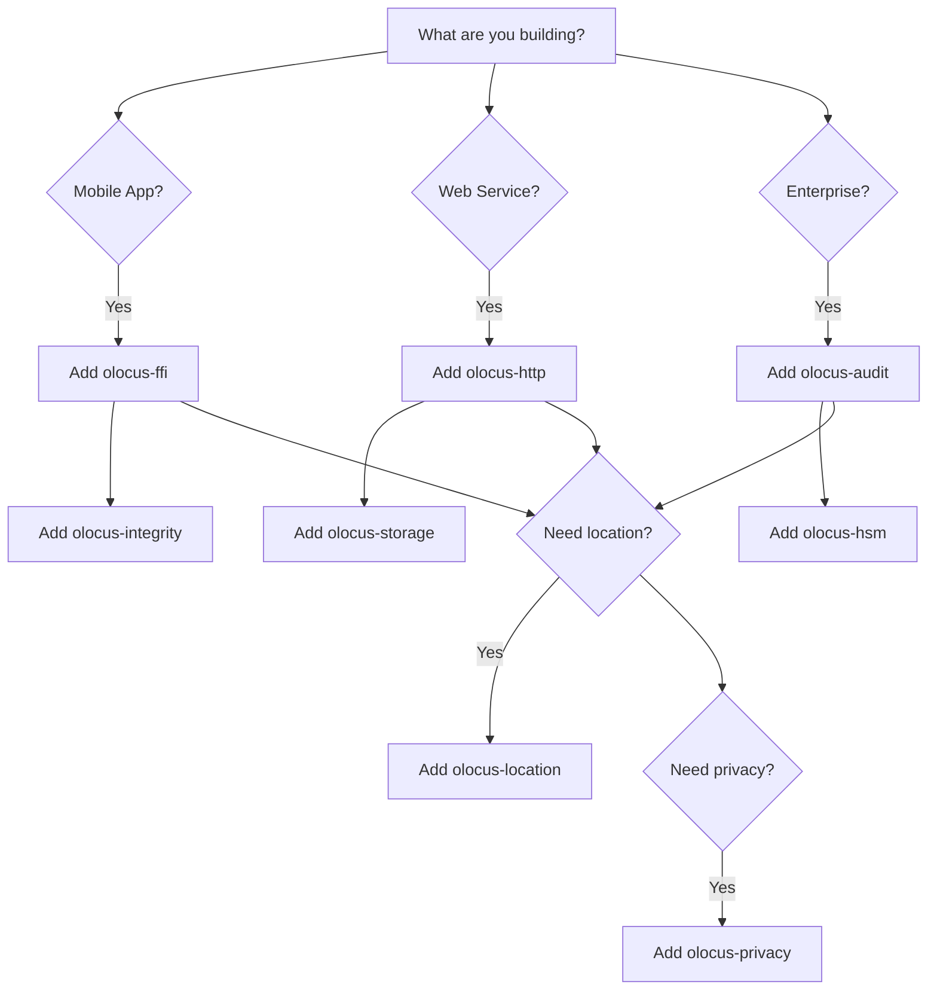

# Choosing the Right Extensions

With 23 extensions available, picking the right ones for your project is crucial. This guide helps you make informed decisions.

## Quick Decision Matrix

| If you need... | Use these extensions |
|----------------|---------------------|
| **Location tracking** | `olocus-location` |
| **User trust/reputation** | `olocus-trust` |
| **Privacy compliance** | `olocus-privacy` |
| **Enterprise audit** | `olocus-audit` + `olocus-policy` |
| **Secure key management** | `olocus-keystore` + `olocus-hsm` |
| **Mobile app** | `olocus-ffi` + `olocus-integrity` |
| **Web API** | `olocus-http` |
| **AI/ML integration** | `olocus-agent` + `olocus-ml` |
| **Quantum resistance** | `olocus-pqc` |
| **Multi-extension coordination** | `olocus-orchestration` |

## Extension Categories

### 🌍 Location & Spatial

#### olocus-location (Stable ✅)
**When to use:**
- GPS tracking applications
- Visit detection
- Geofencing
- Location privacy

**Key features:**
- DBSCAN clustering for visit detection
- Spoofing detection
- Privacy obfuscation (grid snapping, noise)
- Fixed-point coordinates for precision

**Example use cases:**
- Fleet tracking
- Contact tracing
- Location-based services
- Travel logging

```toml
[dependencies]
olocus-location = "0.1"
```

### 🔐 Security & Trust

#### olocus-trust (Stable ✅)
**When to use:**
- Building reputation systems
- Peer-to-peer trust networks
- Identity verification
- Social attestations

**Key features:**
- DIDs (Decentralized Identifiers)
- Trust credentials
- Reputation algorithms (PageRank, EigenTrust)
- Spatial-temporal attestations

```toml
[dependencies]
olocus-trust = "0.1"
```

#### olocus-integrity (Stable ✅)
**When to use:**
- Mobile app security
- Device attestation
- Anti-fraud measures

**Platform support:**
- iOS: App Attest
- Android: Play Integrity
- Jailbreak/root detection

```toml
[dependencies]
olocus-integrity = "0.1"
```

#### olocus-hsm (Stable ✅)
**When to use:**
- Enterprise key management
- High-security environments
- Regulatory compliance

**Supported HSMs:**
- Thales Luna
- AWS CloudHSM
- Azure Key Vault
- HashiCorp Vault

```toml
[dependencies]
olocus-hsm = { version = "0.1", features = ["pkcs11"] }
```

#### olocus-pqc (Beta 🔶)
**When to use:**
- Future-proofing against quantum computers
- High-security applications
- Government/military systems

**Algorithms:**
- Dilithium (signatures)
- ML-KEM/Kyber (key exchange)

```toml
[dependencies]
olocus-pqc = "0.1"
```

### 🎯 Data & Privacy

#### olocus-privacy (Stable ✅)
**When to use:**
- GDPR/CCPA compliance
- Data minimization
- Anonymous analytics

**Techniques:**
- k-anonymity
- Differential privacy
- Zero-knowledge proofs

```toml
[dependencies]
olocus-privacy = "0.1"
```

#### olocus-credentials (Stable ✅)
**When to use:**
- W3C Verifiable Credentials
- Identity management
- Selective disclosure

```toml
[dependencies]
olocus-credentials = "0.1"
```

### ⚡ Infrastructure

#### olocus-storage (Stable ✅)
**When to use:**
- Persistent block storage
- Different backend needs

**Backends:**
- Memory (testing)
- Filesystem (simple)
- RocksDB (performance)
- SQLite (compatibility)

```toml
[dependencies]
olocus-storage = { version = "0.1", features = ["rocksdb"] }
```

#### olocus-http (Beta 🔶)
**When to use:**
- REST API needed
- Web service integration

```toml
[dependencies]
olocus-http = "0.1"
```

#### olocus-metrics (Stable ✅)
**When to use:**
- Production monitoring
- Performance tracking

**Export formats:**
- Prometheus
- OpenTelemetry
- StatsD

```toml
[dependencies]
olocus-metrics = { version = "0.1", features = ["prometheus"] }
```

### 🏢 Enterprise

#### olocus-orchestration (Beta 🔶)
**When to use:**
- Complex multi-extension workflows
- Event-driven architecture
- Pipeline processing

```toml
[dependencies]
olocus-orchestration = "0.1"
```

#### olocus-audit (Alpha 🔷)
**When to use:**
- Compliance requirements
- Immutable audit logs
- Enterprise governance

**Compliance frameworks:**
- GDPR
- HIPAA
- SOC2
- PCI-DSS

```toml
[dependencies]
olocus-audit = "0.1"
```

### 🤖 AI & ML

#### olocus-agent (Alpha 🔷)
**When to use:**
- AI agent collaboration
- Agent performance tracking
- Reliability scoring

```toml
[dependencies]
olocus-agent = "0.1"
```

#### olocus-ml (Alpha 🔷)
**When to use:**
- On-device inference
- Federated learning
- Privacy-preserving ML

```toml
[dependencies]
olocus-ml = "0.1"
```

## Common Extension Combinations

### Mobile Location App
```toml
[dependencies]
olocus-core = "0.1"
olocus-location = "0.1"
olocus-ffi = "0.1"
olocus-integrity = "0.1"
olocus-keystore = "0.1"
```

### Enterprise Platform
```toml
[dependencies]
olocus-core = "0.1"
olocus-orchestration = "0.1"
olocus-audit = "0.1"
olocus-policy = "0.1"
olocus-hsm = "0.1"
olocus-metrics = "0.1"
```

### Privacy-First Application
```toml
[dependencies]
olocus-core = "0.1"
olocus-privacy = "0.1"
olocus-credentials = "0.1"
olocus-threshold = "0.1"
```

### Web Service
```toml
[dependencies]
olocus-core = "0.1"
olocus-http = "0.1"
olocus-storage = { version = "0.1", features = ["sqlite"] }
olocus-metrics = "0.1"
```

## Extension Selection Flowchart



## Performance Considerations

### Lightweight Extensions (< 1MB)
- `olocus-core`
- `olocus-keystore`
- `olocus-metrics`

### Medium Extensions (1-5MB)
- `olocus-location`
- `olocus-trust`
- `olocus-privacy`

### Heavy Extensions (> 5MB)
- `olocus-ml`
- `olocus-pqc`
- `olocus-hsm` (with drivers)

## Platform Compatibility

| Extension | iOS | Android | Web | Server |
|-----------|-----|---------|-----|--------|
| olocus-core | ✅ | ✅ | ✅ | ✅ |
| olocus-ffi | ✅ | ✅ | ✅ | ❌ |
| olocus-integrity | ✅ | ✅ | ❌ | ❌ |
| olocus-hsm | ❌ | ❌ | ❌ | ✅ |
| olocus-http | ❌ | ❌ | ✅ | ✅ |

## Migration Path

### Starting Simple
```toml
# Start with core only
[dependencies]
olocus-core = "0.1"
```

### Adding Features
```toml
# Add extensions as needed
[dependencies]
olocus-core = "0.1"
olocus-location = "0.1"  # Added for GPS
olocus-trust = "0.1"     # Added for reputation
```

### Going Enterprise
```toml
# Full enterprise stack
[dependencies]
olocus-core = "0.1"
olocus-orchestration = "0.1"
olocus-audit = "0.1"
olocus-policy = "0.1"
olocus-hsm = "0.1"
olocus-metrics = "0.1"
olocus-schema = "0.1"
```

## Dependency Management

Extensions can have dependencies on each other:

```toml
# olocus-orchestration manages other extensions
[dependencies]
olocus-orchestration = "0.1"
# Automatically coordinates:
# - olocus-location
# - olocus-trust
# - olocus-privacy
```

## Getting Help

### Extension Documentation
- Each extension has detailed docs in `/extensions/`
- API reference in `/api/`
- Tutorials in `/tutorials/`

### Decision Support
- [Extension Selection Guide](../extensions/selection-guide)
- [Extension Taxonomy](../reference/algorithm-ids)
- [Architecture Guide](../architecture/design-rationale)

### Community
- Ask in [Discussions](https://codeberg.org/olocus/forum/issues)
- Check existing [Use Cases](../case-studies/supply-chain)

## Next Steps

Now that you've chosen your extensions:
- [Explore extension-specific docs](../extensions/overview)
- [Follow a tutorial](../tutorials/location-tracker)
- [Read the API reference](../api/core)
- [Join the community](https://codeberg.org/olocus/protocol)