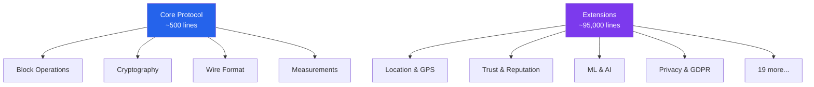

# Welcome to Olocus Protocol

:::tip tagline
**Distributed trust infrastructure where humans, AI agents and machines collaborate securely.**
:::

## What is Olocus?

The Olocus Protocol is a minimal, extensible cryptographic protocol for timestamped data chains with a universal measurement foundation. Inspired by the simplicity of HTTP and SMTP, it provides a rock-solid foundation for building distributed trust systems.

<div className="extension-grid">
  <div className="extension-card">
    <div className="extension-card__title">🚀 Zero Dependencies</div>
    <div className="extension-card__description">
      Pure Rust implementation with no external C dependencies. Build and deploy anywhere Rust runs.
    </div>
  </div>
  
  <div className="extension-card">
    <div className="extension-card__title">🔐 Cryptographically Secure</div>
    <div className="extension-card__description">
      Ed25519 signatures, SHA-256 hashing, and comprehensive downgrade protection built-in.
    </div>
  </div>
  
  <div className="extension-card">
    <div className="extension-card__title">📏 Minimal Core</div>
    <div className="extension-card__description">
      ~500 lines of essential code. Everything else is an optional extension.
    </div>
  </div>
  
  <div className="extension-card">
    <div className="extension-card__title">🧩 23 Extensions</div>
    <div className="extension-card__description">
      From GPS tracking to AI inference, privacy compliance to quantum resistance.
    </div>
  </div>
</div>

## Quick Example

```rust title="Create your first block in 5 lines"
use olocus_core::*;

let key = generate_key();
let genesis = Block::genesis(EmptyPayload, &key, current_timestamp());
let block2 = Block::next(&genesis, EmptyPayload, &key, current_timestamp())?;
verify_block(&block2, Some(&genesis))?;
println!("Chain verified! 🎉");
```

## Use Cases

### 🌍 Location & Presence
Track and verify physical presence with spoofing detection, clustering algorithms, and privacy-preserving obfuscation.

### 🤝 Trust Networks
Build reputation systems, attestation protocols, and peer-to-peer trust relationships with cryptographic guarantees.

### 🤖 AI Agent Collaboration
Enable secure collaboration between humans, AI agents, and IoT devices with measurement-aware ML inference.

### 🏢 Enterprise Compliance
Meet GDPR, HIPAA, SOC2, and PCI-DSS requirements with built-in audit logging and policy enforcement.

### 🔮 Future-Proof Security
Post-quantum cryptography ready with Dilithium and ML-KEM, plus comprehensive algorithm negotiation.

## Core Concepts

The protocol is built on four fundamental concepts:

1. **Blocks** - Timestamped, signed containers for any data
2. **Chains** - Cryptographically linked sequences of blocks
3. **Measurements** - Universal representation of uncertain data
4. **Extensions** - Modular features you can mix and match

## Getting Started

:::info Prerequisites
You only need **Rust 1.75+** installed. That's it! No C compilers, no system libraries, no complex setup.
:::

```bash
# Clone the repository
git clone https://codeberg.org/olocus/protocol.git
cd protocol

# Build everything (pure Rust!)
cargo build --release

# Run tests (1,400+ passing!)
cargo test

# Try the demo
cargo run --example protocol_demo
```

## Architecture at a Glance



## Why Olocus?

### Inspired by HTTP/SMTP
Just as HTTP powers the web and SMTP powers email, Olocus aims to be the foundational protocol for distributed trust systems.

### Radical Simplicity
The core protocol is intentionally minimal. Complex features are added through extensions, not by bloating the core.

### Production Ready
With comprehensive tests, formal verification models, and real-world deployments, Olocus is ready for production use.

### Community Driven
Open source under MIT/Apache-2.0 license. Contributions welcome on [Codeberg](https://codeberg.org/olocus/protocol).

## Next Steps

<div className="extension-grid">
  <a href="/getting-started/quickstart" className="extension-card">
    <div className="extension-card__title">📚 Quick Start Guide</div>
    <div className="extension-card__description">
      Get up and running in 5 minutes
    </div>
  </a>
  
  <a href="/concepts/philosophy" className="extension-card">
    <div className="extension-card__title">💡 Design Philosophy</div>
    <div className="extension-card__description">
      Understand the principles behind Olocus
    </div>
  </a>
  
  <a href="/extensions/overview" className="extension-card">
    <div className="extension-card__title">🧩 Browse Extensions</div>
    <div className="extension-card__description">
      Explore the 23 available extensions
    </div>
  </a>
  
  <a href="/api/core" className="extension-card">
    <div className="extension-card__title">📖 API Reference</div>
    <div className="extension-card__description">
      Complete API documentation
    </div>
  </a>
</div>

---

<div style={{textAlign: 'center', marginTop: '3rem'}}>
  <h3>Ready to build something amazing?</h3>
  <a href="/getting-started/quickstart" className="button button--primary button--lg">
    Get Started →
  </a>
</div>